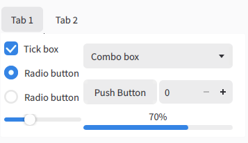
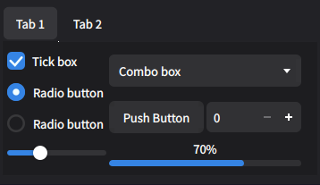

# kdeadwaita

Adwaita theme for KDE. Up-to-date with Libadwaita 1.7 colors.




Hard fork of velixivel/Libadwaita-KDE, accessed from Neikon/Libadwaita-KDE. Contains Libadwaita-KDE Kvantum theme by mellowa, based on Orchis by Vince Liuice.

## usage
This repo contains no theme for you to directly download. You need to build the theme. This allows you to select whether you want to use light or dark mode, as well as letting you select which accent color you want.

The `base` directory contains the base theme. To build your custom theme, run `./build.sh <light|dark> <accent color>`. Then, import the generated theme file into Kvantum manager. If you're feeling adventurous, you can run `./build.sh <light|dark> <accent color> --install`, which should install the built theme for you on most FHS distributions.

# nix
Nix users can install this theme by adding this module to their home-manager config:

```nix
{
  lib,
  config,
  options,
  pkgs,
  ...
}:
{

  home.packages = with pkgs; [
    libsForQt5.qtstyleplugin-kvantum
    qt6Packages.qtstyleplugin-kvantum
  ];

  qt = {
    enable = true;
    platformTheme.name = "qtct";
    style = {
      name = "kvantum";
      package = with pkgs; [
        libsForQt5.qtstyleplugin-kvantum
        qt6Packages.qtstyleplugin-kvantum
      ];
    };
  };

  xdg.configFile = {
    "Kvantum/kvantum.kvconfig".text = ''
      [General]
      theme=libadwaita-kde-dark-blue
    '';

    "Kvantum/libadwaita-kde-dark-blue".source = /path/to/your/built/theme;
  };
```

Remember to replace `/path/to/your/built/theme` with the path to your theme.


